<link href="https://fonts.googleapis.com/css2?family=Cairo:wght@400;600;700&display=swap" rel="stylesheet">

# Trusted Social Network Platform
# منصة تواصل اجتماعي آمنة وموثوقة

**إعداد:**
هديل حمود الحمادي | وعد عبدالله داود | ميرا فهمي البناء

---

## الملخص

تشير الدراسات الحديثة إلى ارتفاع ملحوظ في اعتماد الطالب وأعضاء هيئة التدريس على وسائل التواصل غير الرسمية مثل واتساب وتليجرام داخل البيئة الجامعية؛ إذ تجاوزت نسبة الاستخدام %70 في عام 2023، مع توقعات بتجاوز %90 بحلول عام 2026. يعود ذلك إلى غياب منصات أكاديمية رسمية تنظّم عملية التواصل، وتضمن الخصوصية، وتحافظ على أمن البيانات. هذا الواقع خلق فجوة واضحة داخل المجتمع الجامعي، وأظهر حاجة ملحّة لمنصة متخصصة تُعالج التشتت، وتُوحّد القنوات الأكاديمية تحت نظام واحد آمن ومنظّم.

انطلاقًا من هذه الحاجة، يأتي مشروع منصة تواصل اجتماعي ليقدّم بيئة جامعية متكاملة تُسهم في تنظيم التواصل الأكاديمي، إدارة المحتوى، وضبط العمليات الأكاديمية اليومية. يعمل النظام كمنصة مركزية تجمع بين الطالب، الأساتذة، والإدارة، وتتيح إدارة المحاضرات، رفع الملفات، متابعة المهام، تنظيم الجداول، ونشر الإعلانات الرسمية. كما يوفّر التطبيق أدوات تواصل فورية ومنظّمة، تساعد في الحد من الفوضى المنتشرة في القنوات غير الأكاديمية.

يركّز النظام بشكل أساسي على:

- توثيق متعدد المراحل (OTP) عبر البريد الإلكتروني لضمان الدخول الآمن.
- تشفير البيانات أثناء الإرسال والتخزين.
- ضوابط صلاحيات دقيقة للتحكم في الوصول إلى الملفات والمحتوى.
- مراقبة النشاط ومنع إساءة الاستخدام عبر لوحة تحكم مخصصة للإدارة الجامعية.
- جدران حماية وتدقيق سجلات Auditing Log لضمان سلامة البيانات ومنع الوصول غير المصرح به.
- سياسات خصوصية تمنع مشاركة بيانات الطالب والأساتذة خارج النظام.

وتتكون منصة تواصل اجتماعي UniLink من ثلاثة مكوّنات رئيسية مترابطة:

1. تطبيق جّوال للطالب والأساتذة لإدارة الجداول والمحاضرات والتواصل.
2. موقع إلكتروني رسمي لعرض المحتوى الأكاديمي وتنظيم العمليات.
3. لوحة تحكم متقدمة (Dashboard) تمكّن الإدارة الجامعية من إدارة المستخدمين، مراقبة المحتوى، إصدار التقارير، وضبط الصلاحيات.

أما من حيث الوظائف الأكاديمية، فيقدّم UniLink ميزات تنظيمية تشمل:

- إنشاء مجموعات دراسية رسمية داخل النظام.
- نشر الإعلانات والمواد الأكاديمية.
- رفع الملفات والمحاضرات بكافة أنواعها.
- نظام مراسلة منظم بين الطالب والأساتذة.
- مزامنة البيانات بين مختلف الأجهزة لضمان سهولة الوصول.

ويقدّم النظام تجربة استخدام مبسّطة تسمح للمستخدم بالانتقال بين الصفحات، الوصول السريع للمحتوى، متابعة الجداول اليومية، وحفظ الملاحظات الأكاديمية. كما يسهّل العثور على المحاضرات، الروابط الرسمية، والملفات دون الحاجة للتنقّل بين منصات متعددة.

---

## Summary

Recent studies indicate a significant increase in the reliance of students and faculty members on informal communication tools such as WhatsApp and Telegram within the university environment, with usage rates exceeding 70% in 2023 and projected to surpass 90% by 2026. This trend stems from the absence of official academic platforms that organize communication processes, ensure privacy, and protect data security. This reality has created a noticeable gap within the university community and revealed an urgent need for a specialized platform that addresses fragmentation and unifies academic channels under one secure and organized system.

Addressing this need, the **UniLink Social Communication Platform** project introduces a comprehensive university environment that contributes to organizing academic communication, managing content, and regulating daily academic processes. The system functions as a centralized platform that brings together students, professors, and administration, enabling the management of lectures, file uploads, task tracking, schedule organization, and dissemination of official announcements. The application also provides instant and organized communication tools, helping to reduce the chaos prevalent in non-academic channels.

The system primarily focuses on:

- Multi-stage authentication (OTP) via email to ensure secure login.
- Data encryption during transmission and storage.
- Precise permission controls to regulate access to files and content.
- Activity monitoring and prevention of misuse through a dedicated dashboard for university administration.
- Firewalls and log auditing to ensure data integrity and prevent unauthorized access.
- Privacy policies that prohibit sharing student and faculty data outside the system.

The UniLink platform consists of three main interconnected components:

1. A mobile application for students and faculty to manage schedules, lectures, and communication.
2. An official website for displaying academic content and organizing processes.
3. An advanced dashboard enabling university administration to manage users, monitor content, generate reports, and adjust permissions.

In terms of academic functions, UniLink offers organizational features including:

- Creation of official study groups within the system.
- Publication of announcements and academic materials.
- Uploading various types of files and lectures.
- A structured messaging system between students and professors.
- Data synchronization across different devices to ensure easy accessibility.

The system provides a simplified user experience, allowing users to navigate between pages, quickly access content, follow daily schedules, and save academic notes. It also facilitates finding lectures, official links, and files without the need to navigate multiple platforms.

---

# الفصل الأول

## 1.1 المقدمة (Introduction)

في ظل التحول الرقمي المتسارع الذي يشهده العالم، أصبحت الجامعات والمؤسسات الأكاديمية أكثر اعتمادًا على الأنظمة الإلكترونية لتنظيم العملية التعليمية وتسهيل التواصل بين الطالب والأساتذة والإدارة. وقد بيّنت الدراسات الحديثة أن نسبة استخدام الطالب والهيئة التدريسية لوسائل التواصل غير الرسمية مثل واتساب وتلجرام تجاوزت %70 خلال عام 2023، مع توقع وصولها إلى %90 بحلول عام 2026. ويعود ذلك إلى غياب منصات أكاديمية مخصصة تلبّي احتياجات المجتمع الجامعي وتوفّر قنوات تواصل رسمية وآمنة، مما جعل المؤسسات التعليمية تعتمد على أدوات غير مناسبة وغير مصمّمة للأغراض التعليمية.

هذا الاعتماد المتزايد على تطبيقات عامة أدى إلى ظهور العديد من التحديات، أبرزها: تشتت المعلومات، ضياع الملفات، اختلاط الأكاديمي بالشخصي، ضعف الأرشفة والتنظيم، إضافة إلى مخاطر الخصوصية وغياب متطلبات الحماية الرقمية. ومع تضخّم أعداد الطالب واتساع العملية التعليمية، أصبحت الحاجة إلى منصة موحدة وآمنة ضرورة ملحّة لضمان جودة التواصل واستمرارية العملية الأكاديمية.

جاء مشروع UniLink ليقدّم منصة جامعية متخصصة تعمل على تنظيم التواصل الأكاديمي وتوفير بيئة رقمية آمنة ومتكاملة تجمع الطالب، الأساتذة، والإدارة ضمن نظام موحّد. تعتمد منصة تواصل اجتماعي على هيكل إداري وتقني يسهّل إدارة الجداول، المحاضرات، الملفات، المهام، والإعلانات، إضافة إلى توفير قنوات تواصل رسمية بين جميع أطراف العملية التعليمية، بحيث تصبح المنصة المرجع الأساسي للمحتوى الأكاديمي داخل الجامعة.

وتوفّر المنصة نظامين متكاملين: تطبيقًا للهواتف الذكية وموقعًا إلكترونيًا للإدارة والمحتوى، مع وجود لوحة تحكم مركزية Dashboard تتيح للجهات الإدارية إدارة المستخدمين، مراقبة الأنشطة، إصدار التقارير، وتطبيق السياسات الأكاديمية بدقة. كما تدعم منصة التواصل الاجتماعي إنشاء مجموعات دراسية رسمية، رفع المحاضرات، نشر الإعلانات، متابعة المهام، وأرشفة الملفات بطريقة منظمة تسهّل الوصول وتمنع التشتت.

وألن العمل الأكاديمي يتطلب مستويات عالية من الخصوصية وحماية البيانات، يتضمن المشروع نظام تحقق ثنائي OTP عبر البريد، تشفير البيانات أثناء النقل والتخزين، إدارة الصلاحيات، مراقبة الأنشطة المشبوهة، وفرض سياسات أمان تشبه المعايير المستخدمة في المؤسسات التعليمية العالمية. ويسهم هذا الجانب الأمني الحيوي في حماية الحسابات، منع الوصول غير المصرح به، حماية المحتوى الأكاديمي، وضمان التواصل داخل بيئة موثوقة ومحمية بالكامل.

---

## 1.2 تعريف المشروع (Project Definition)

يُعد المشروع المقترح منصة رقمية متكاملة تتكوّن من تطبيق جّوال وموقع إلكتروني، صُمّمت خصيصًا لتسهيل وتنظيم التواصل الأكاديمي داخل الجامعات، من خلال ربط الطالب والأساتذة والإدارة ضمن نظام واحد موحّد. وتهدف المنصة إلى تحسين العملية التعليمية عبر توفير بيئة رسمية وآمنة لإدارة المحاضرات، الملفات، الإعلانات، المهام، والمجموعات الدراسية، بما يضمن وصول المحتوى الصحيح للمستخدم في الوقت المناسب دون تشتّت أو ضياع.

وتعمل المنصة على تبسيط العمليات الأكاديمية اليومية من خلال ربط جميع الأطراف ذات العلاقة مباشرة داخل النظام، بحيث يتمكن الأستاذ من رفع المحاضرات والمهام وإرسال الإعلانات فورًا، بينما يستقبل الطالب المحتوى بشكل فوري ومنظم، وتتولى الإدارة متابعة سير العملية التعليمية عبر لوحة تحكم مركزية مزوّدة بإحصاءات وتقارير تفصيلية. كما يدعم النظام أسلوبًا حديثًا لإدارة المحتوى الأكاديمي يشبه مفهوم إدارة سلسلة الإمداد الرقمية (Academic Digital SCM)، والذي يُعنى بضمان انتقال المعلومات بشكل دقيق من المصدر إلى المستفيد النهائي دون تشويش.

وتوفّر المنصة "مستودعًا أكاديميًا" رقميًا مركزيًا يُخزّن جميع الملفات والمواد الدراسية، بحيث يصبح الطالب قادرين على الوصول إليها في أي وقت، مع إمكانية متابعة المهام، استقبال الإعلانات الأكاديمية، والتفاعل مع مجموعاتهم التعليمية. وتمكّن المنصة الأساتذة من تنظيم محتواهم والإشراف على الطالب، في حين تحصل الإدارة الجامعية على رؤية شاملة حول النشاط الأكاديمي، ومستوى التفاعل، وحركة المحتوى داخل النظام.

وانطلاقًا من كون المشروع يخدم قطاعًا تعليميًا حساسًا يتعامل مع معلومات شخصية وأكاديمية، فقد تم التركيز بشكل كبير على دمج حلول أمنية داخل النظام، عبر توفير آليات تحقق متعددة، ونظام صلاحيات دقيق، وتشفير لحركة البيانات، إضافة إلى مراقبة الأنشطة واكتشاف السلوكيات غير الطبيعية، مما يضمن حماية الحسابات ومنع الوصول غير المصرّح به، وتأمين الملفات والاتصالات الأكاديمية وفقًا لأفضل الممارسات الأمنية. كما يدعم النظام تسجيل الدخول عبر رمز تحقق يُرسل إلى البريد الجامعي لضمان عدم انتحال الهوية.

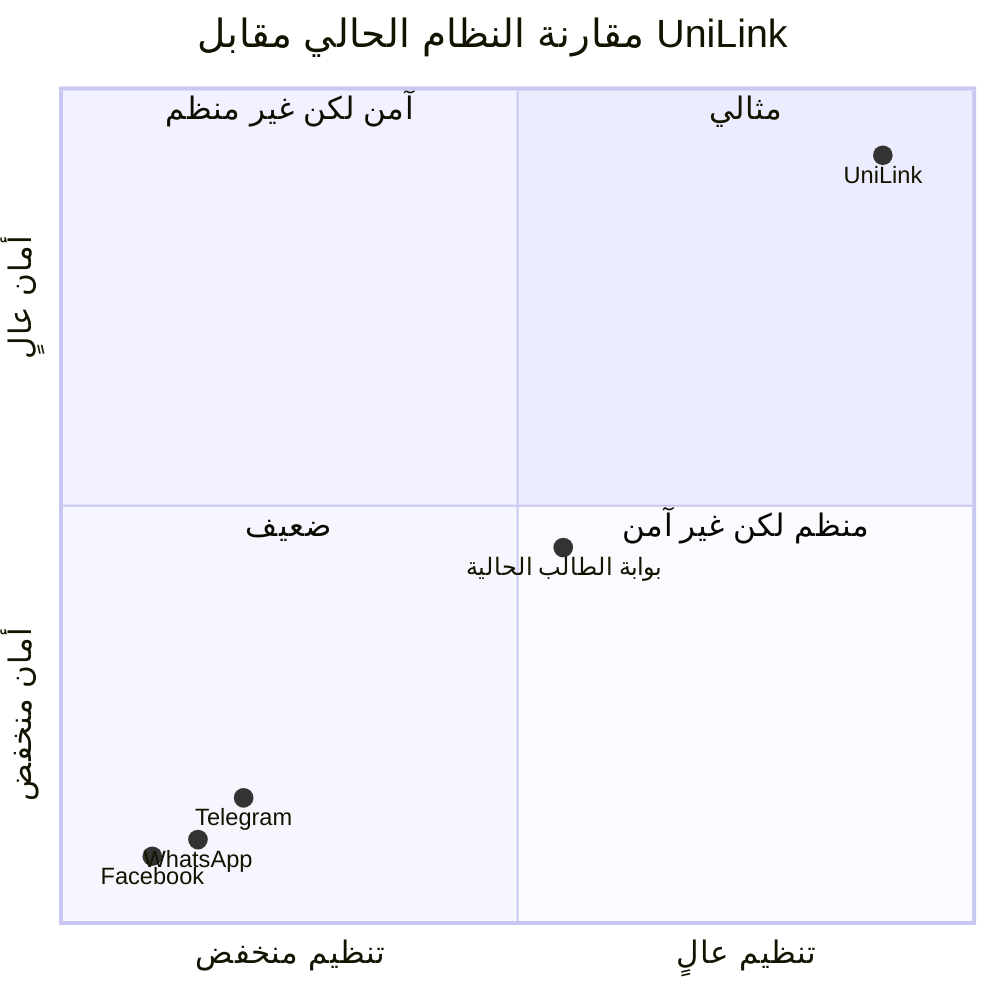

---

## 1.3 تحديد المشكلة (Problem Statement)

في السنوات الأخيرة، ومع التحوّل السريع نحو التعليم الرقمي خلال فترات الإغلاق التي فرضتها الجوائح العالمية، واجهت الجامعات تحدّيات كبيرة في إدارة التواصل الأكاديمي. اضطر الطالب والأساتذة إلى الاعتماد على تطبيقات عامة مثل واتساب وتلجرام لمتابعة المحاضرات وتبادل الملفات، الأمر الذي كشف هشاشة المنظومة التعليمية عند استخدام أدوات غير مخصصة للأغراض الأكاديمية. فقد أدى الاعتماد على هذه القنوات غير الرسمية إلى تشتت المعلومات، ضياع المحتوى الأكاديمي، صعوبة الوصول إلى الملفات الصحيحة، وغياب بيئة آمنة تحمي خصوصية الطالب والأساتذة، إضافة إلى ظهور مخاطر متزايدة مثل التسريب، الاحتيال، انتحال الهوية، والوصول غير المصرّح به.

وقد عانت مؤسسات التعليم العالي من قصور واضح في تنظيم المحتوى، حيث توزّعت المحاضرات والمهام والملفات عبر مجموعات متعددة غير خاضعة للرقابة، مما جعل متابعة العملية الأكاديمية أمرًا مرهقًا وغير فعّال. كما أدى غياب منصة رسمية إلى صعوبة توثيق النشاط الأكاديمي، ضعف التواصل بين الطالب والأساتذة، وتكرار فقدان المعلومات الحيوية بسبب الاعتماد على أدوات غير مستقرة وغير آمنة. وتزايدت التحديات خلال الفصول المكثفة وفترات الامتحانات، حيث أصبحت الفوضى المعلوماتية سببًا مباشرًا في تدني مستوى التحصيل العلمي لدى الطالب.

وبالإضافة إلى ذلك، كشف هذا الوضع عن مخاطر أمنية خطيرة تهدد خصوصية أفراد الجامعة ومحتواها الأكاديمي. فقد أدى استخدام منصات مفتوحة وغير محمية إلى مشاركة ملفات حساسة خارج نطاق السيطرة، مما جعل البيانات عرضة للتسريب أو الوصول غير المصرّح به. كما تسببت الطبيعة غير الرسمية لهذه الأدوات في انتحال الهوية داخل مجموعات الطالب، واختلاط المحتوى الشخصي بالأكاديمي، وهو ما يخالف مبادئ الأمن وحوكمة البيانات في المؤسسات التعليمية.

ومن هذا المنطلق، جاء تطوير مشروع UniLink كحل تقني متكامل يستهدف معالجة هذه الإشكاليات من جذورها، من خلال توفير منصة جامعية موحدة وآمنة تربط جميع أطراف العملية التعليمية في نظام واحد منظم. ويهدف المشروع إلى إعادة بناء بيئة التواصل الأكاديمي داخل الجامعات بطريقة تضمن سهولة الوصول إلى المحتوى، تنظيم المحاضرات والواجبات، توحيد قنوات التواصل، وحماية الخصوصية من خلال تطبيق معايير الأمن الحديثة مثل التحقق الثنائي، تشفير البيانات، التحكم في الصلاحيات، وإدارة الوصول (Access Control). كما يوفر النظام آليات مراقبة وحوكمة تحمي المحتوى الأكاديمي وتضمن تتبع الأنشطة ومراجعة العمليات بما يتوافق مع متطلبات أمان البيانات.

---

## 1.4 أهداف المشروع (Project Objectives)

يهدف مشروع UniLink إلى بناء منصة أكاديمية رقمية متكاملة تعمل عبر تطبيق جّوال وموقع إلكتروني، بحيث تكون القناة الرسمية المعتمدة للتواصل الأكاديمي داخل الجامعات. ويركّز المشروع على معالجة التشتت التعليمي، تنظيم تبادل المحتوى، وتوفير بيئة اتصال آمنة وموحّدة تربط الطالب بالأساتذة والإدارة داخل نظام واحد يعكس المعايير الحديثة للحوكمة الأكاديمية والأمن. حيث يؤسّس بنية معلوماتية محكمة تضمن حماية البيانات ومنع الوصول غير المصرح به مع الالتزام بمعايير الخصوصية الرقمية المتقدمة داخل البيئة الجامعية.

وتتلخص أهم أهداف المشروع فيما يلي:

**1. تحسين جودة التواصل الأكاديمي وتقليل التشتت المعلوماتي**

توحيد قنوات التواصل داخل الجامعة، بحيث ينتقل الطالب والأساتذة إلى منصة رسمية واحدة بدلاً من الاعتماد على مجموعات غير منظمة في تطبيقات عامة. ويؤدي هذا التوحيد إلى إيصال الإعلانات، الجداول، المهام، والملفات الأكاديمية بشكل مركزي دون ضياع أو تشويش، مع ضمان حفظ السجلات الأكاديمية داخل منظومة آمنة.

**2. إنشاء نظام متكامل لإدارة المحتوى الأكاديمي (Academic Content Management System)**

يوفر النظام مستودعًا مركزيًا للملفات والمحاضرات، بحيث:
- تُنظم المواد تلقائيًا حسب المقرر.
- تُعرض الملفات بطريقة مرتّبة وسهلة الوصول.
- يمكن تتبع المواد المضافة حديثًا والمواد التي لم يطّلع عليها الطالب بعد.
- يتوفر مسار موثوق لنشر وتوزيع المحتوى بين الأساتذة والطالب، بعيدًا عن الطرق التقليدية التي تؤدي إلى ضياع الملفات وتكرارها.

هذا النظام يدعم الإدارة الجامعية في مراقبة حركة المحتوى وضمان الالتزام بالمعايير الأكاديمية.

**3. تمكين الطالب من الوصول السريع إلى المعلومات الأكاديمية**

يساعد النظام في حل مشكلة صعوبة الوصول إلى المحاضرات والواجبات عبر:
- توفير نظام بحث متقدم داخل المنصة.
- عرض الجداول والمهام والإعلانات في واجهة واضحة.
- تنظيم المحتوى الأولي للجامعة (المحاضرات – الجداول – الواجبات – الإعلانات).

وبذلك يتمكّن الطالب من الوصول للمعلومات الصحيحة في الوقت المناسب دون الحاجة لتتبع مجموعات ومصادر متعددة غير رسمية.

**4. تعزيز الأمن داخل البيئة الأكاديمية**

- تطبيق تقنيات التحقق الثنائي (2FA): عند تسجيل الدخول يتم إرسال رمز تحقق (OTP - One Time Password) للبريد الجامعي لضمان منع أي وصول غير مصرح به.
- حماية البيانات الحساسة عبر التشفير (Data Encryption): يشمل ذلك تشفير كلمات المرور بأساليب قوية (Hashing + Salting)، تشفير الاتصالات (HTTPS/TLS)، تشفير الملفات عند الرفع والتخزين.
- عزل صلاحيات المستخدمين (Access Control): يتم منح كل مستخدم صلاحيات محددة (طالب – أستاذ – إدارة) لضمان عدم تجاوز الصلاحيات Privilege Escalation Protection.
- تسجيل الأنشطة (Audit Logging): يتم تسجيل جميع العمليات الحساسة داخل النظام مثل: تعديل المحتوى، إضافة ملفات، حذف بيانات، دخول المستخدمين. وهو ما يسهم في اكتشاف السلوكيات المشبوهة، دعم التحقيق عند حدوث أي اختراق، وحماية الملفات والمواد الأكاديمية من التلاعب.

لا يمكن حذف أو تعديل المواد إلا من قبل الأشخاص المصرّح لهم، ويتم حفظ نسخ احتياطية لحماية المحتوى من الضياع.

**5. دعم الإدارة الجامعية في المتابعة واتخاذ القرار**

تقدم المنصة أدوات للقياس والمتابعة، مثل: مراقبة نشاط المقررات، معرفة نسبة التفاعل، متابعة استهلاك المحتوى، مراقبة أداء الأقسام الأكاديمية، وإصدار تقارير شاملة وموثوقة. وتساعد هذه المعلومات في تحسين الأداء، اتخاذ القرارات، وتقييم جودة العملية التعليمية.

---

## 1.5 أهمية المشروع (Project Importance)

تكتسب منصة UniLink أهميتها من قدرتها على معالجة واحدة من أكثر المشكلات إلحاحًا داخل البيئة الجامعية الحديثة: غياب نظام تواصل أكاديمي رسمي وآمن. فقد أثبتت التجارب خلال موجات التحول الرقمي أن الاعتماد على منصات عامة وغير مخصّصة للتعليم أدى إلى تشتت المحتوى الأكاديمي، ضياع الملفات، تشويش التواصل، وغياب أي إطار يضمن الخصوصية أو حماية البيانات. ومن هنا جاءت الحاجة إلى منصة جامعية تضمن التنظيم، السرعة، الموثوقية، والأمان في نقل المعلومات بين الطالب، الأساتذة، والإدارة الجامعية.

تسهم المنصة بشكل مباشر في تحسين جودة التعليم من خلال توفير قناة رسمية تُسهل متابعة المحاضرات والواجبات والإعلانات الأكاديمية، مع ضمان وصول المعلومات في الوقت المناسب وبطريقة منظمة. كما تمكّن الأساتذة من إدارة المحتوى التعليمي بسهولة، ونشر المواد بشكل موثوق دون الاعتماد على وسائل التواصل الشخصية التي تفتقر إلى السياسات الأكاديمية والأمنية.

ولا تقتصر أهمية المشروع على الجوانب الإدارية والتعليمية فحسب، بل تمتد إلى تعزيز الأمن داخل البيئة الجامعية. فقد تم تصميم النظام بآليات تضمن حماية بيانات المستخدمين، ومنع تسرب المعلومات، وتطبيق معايير قوية لإدارة الهويات والصلاحيات، مما يمنع الوصول غير المصرح به ويحد من مخاطر استخدام تطبيقات عامة لا توفر حماية كافية. ويُعد دمج أمن المعلومات جزءًا أساسيًا من بنية النظام، من خلال استخدام أنظمة تحقق متعددة العوامل (MFA)، تشفير البيانات، مراقبة الأنشطة المشبوهة، وتطبيق سياسات وصول صارمة.

---

## 1.6 نطاق المشروع وحدوده (Project Scope & Limitations)

### أولًا: نطاق المشروع (Project Scope)

**1. إدارة المستخدمين (Users Management)**
- تسجيل دخول آمن للطالب والأساتذة والإداريين.
- إدارة الحسابات الشخصية وتحديث البيانات.
- نظام صلاحيات يمنح كل فئة مستوى وصول مختلف.

**2. نظام المراسلة والتواصل (Messaging & Communication)**
- إرسال واستقبال الرسائل الفردية والجماعية.
- إنشاء مجموعات دراسية أكاديمية.
- مشاركة الملفات والصور والملاحظات داخل المحادثات.

**3. إدارة المقررات والمواد العلمية (Courses Management)**
- عرض المواد الدراسية المسجّلة لكل طالب.
- رفع المحاضرات والواجبات والمراجع.
- إمكانية تفاعل الطالب مع المحتوى الأكاديمي.

**4. الإعلانات والإشعارات (Announcements & Notifications)**
- نشر الإعلانات من قبل الإدارة أو الأساتذة.
- إرسال إشعارات فورية للمستخدمين (مواعيد، اختبارات، محاضرات).

**5. الملفات الأكاديمية (File Center)**
- رفع، تحميل، وتنظيم الملفات ضمن أقسام واضحة.
- إمكانية البحث داخل الملفات.

**6. التقويم الأكاديمي (Academic Calendar)**
- عرض مواعيد المحاضرات، الاختبارات، والاجتماعات.
- ربط المهام والملاحظات بالتواريخ المحددة.

**7. الإشراف الإداري والتحكم (Admin Tools)**
- الإشراف على المجموعات.
- إدارة المحتوى المخالف.
- متابعة النشاط العام للمستخدمين.

**8. الأمان وحماية البيانات (Security Layer)**
- التحقق الثنائي (2FA).
- تشفير الرسائل والملفات.
- حفظ البيانات داخل خوادم آمنة.

### ثانيًا: حدود المشروع (Project Limitations)

- لا يشمل تسجيل مواد الطالب في النظام الأكاديمي.
- لا يشمل إدارة العلامات ودرجات الامتحانات.
- لا يقدم خدمات بث محاضرات مباشرة (Live Streaming).
- لا يقوم بإصدار نتائج أو كشوف درجات رسمية.
- لا يقدّم خدمات دفع إلكتروني أو معاملات مالية.
- لا يتكامل مع أنظمة جامعية خارجية في المرحلة الأولى.
- لا يحل محل منصات إدارة التعلم LMS بشكل كامل.

---

## 1.7 الأدوات والتقنيات المستخدمة في المشروع (Tools & Technologies Used)

### أولًا: الموارد البرمجية (Software Resources)

| الأداة / التقنية | فئة الأداة | سبب الاستخدام داخل مشروع UniLink |
|---|---|---|
| Microsoft Word | Documentation توثيق | لإعداد المستندات الرسمية، التحليل، الجداول، التقرير النهائي |
| Figma | UI/UX Design | لتصميم الواجهات الأولية (Prototype) الخاصة بالمنصة وتسهيل عرض الفكرة للمشرفين |
| PowerPoint | Presentation | لإعداد العرض الأكاديمي النهائي ومناقشة المشروع |
| XAMPP | Local Server | لإنشاء خادم محلي لتشغيل النظام أثناء التطوير وإدارة قواعد البيانات |
| Visual Studio Code | Code Editor | لكتابة الأكواد الخاصة بالواجهة الأمامية والخلفية |
| PHP | Backend Language | لتنفيذ منطق النظام العام وبناء الوظائف الأساسية |
| Laravel 9 | Backend Framework | لبناء نظام آمن، منظم، وداعم لـ APIs + حماية افتراضية مدمجة |
| MySQL | Database Engine | لتخزين بيانات الطالب، الملفات الأكاديمية، الإعلانات، الجداول |
| Android Studio | Mobile Development | لتطوير النسخة الأولية من تطبيق أندرويد للطالب |
| Postman | API Testing | لاختبار الربط بين الواجهة الأمامية والخلفية والتأكد من سلامة الطلبات |

### ثانيًا: الموارد الأمنية

| الإجراء الأمني | الهدف |
|---|---|
| JWT (JSON Web Tokens) | لتسجيل الدخول الآمن |
| 2FA Authentication | للتحقق الثنائي |
| BCRYPT – Hashing | حماية كلمات مرور المستخدمين |
| HTTPS / SSL Certificate | لتأمين الاتصال |
| استخدام ORM في Laravel | منع SQL Injection |
| حماية XSS و CSRF | منع التلاعب والحقن في الواجهات |
| Role-Based Access Control – RBAC | تحديد الصلاحيات حسب الدور الأكاديمي |
| Audit Logging | تسجيل ومراجعة النشاطات الحساسة |
| API Security Tokens | تأمين الاتصال بين التطبيق والخادم |
| Firewall منطقي | حماية الخادم من الاتصالات غير المصرح بها |
| OWASP Top 10 Testing | التحقق من خلو النظام من الثغرات الشائعة |
| Least Privilege DB Design | تقليل تأثير الاختراق في حال حدوثه |

---

## 1.8 المنهجية المستخدمة في المشروع (Project Methodology)

---

## 1.9 الجدول الزمني للمشروع (Project Timetable)

---

## 1.10 مخطط جانت للمشروع (Project Gantt Chart)

---

## 1.11 تنظيم التقرير (Report Organization)

---

# الفصل الثاني

## 2.1 خلفية الدراسة (Background)

لمنصات التواصل الاجتماعي، التي أصبحت وسيلة رئيسية للتواصل وتبادل المعلومات بين الأفراد والمؤسسات. ومع أنّ هذه المنصات قد سهّلت مشاركة الأخبار والملفات وتنظيم الأنشطة المختلفة، إلا أن معظمها منصات عامة مملوكة لشركات عالمية، ولا تُصَّمم بالضرورة بما يراعي خصوصية بيئة الجامعات واحتياجاتها الأكاديمية والإدارية، كما لا توفّر دائمًا التحكم الكافي في من يمكنه الاطّلاع على المحتوى أو الوصول إلى بيانات المستخدمين.

في البيئة الجامعية يعتمد الطالب وأعضاء هيئة التدريس والموظفون غالبًا على مجموعات في تطبيقات عامة مثل فيسبوك وواتساب وتيليغرام لإرسال الإعلانات وتنظيم الجداول وتبادل المواد التعليمية والتنسيق للفعاليات. هذا الاعتماد على منصات خارجية قد يعرّض البيانات الشخصية وملفات الطالب والمناقشات الأكاديمية لخطر التسريب أو الاستخدام غير المصرّح به، كما يجعل من الصعب إدارة الصلاحيات وضبط الوصول للمعلومات وفق سياسات الجامعة ولوائحها. إضافة إلى ذلك، لا توفّر هذه المنصات عادةً أرشفة منظّمة للرسائل والملفات بحيث تُسهل مراجعتها والعودة إليها عند الحاجة، ولا تُمِّكن الإدارة من تتبّع الأنشطة والتقارير بصورة رسمية.

انطلاقًا من هذه التحديات تبرز الحاجة إلى إنشاء منصة تواصل اجتماعي آمنة ومخصّصة للجامعة، تكون محصورة على مجتمع الجامعة من طلاب وأكاديميين وموظفين، وتدعم التواصل الرسمي والمنظّم في إطار يحافظ على سريّة البيانات ويضمن خصوصية المستخدمين. تهدف هذه المنصة إلى توفير بديل آمن للمنصات العامة عبر توثيق حسابات المستخدمين، وتنظيم المجموعات بحسب المواد والأقسام والوحدات الإدارية، وتمكين نشر الإعلانات والرسائل والملفات داخل بيئة موثوقة يمكن التحكم فيها، مع إتاحة سجل واضح وأدوات متابعة وتقارير تساعد إدارة الجامعة على مراقبة الأنشطة والتفاعل داخل المنصة.

بهذه الخلفية يأتي مشروع "منصة تواصل اجتماعي آمنة" (Trusted Social Network Platform) كخطوة عملية لتوظيف تقنيات الويب في بناء بيئة تواصل رقمية موثوقة تدعم العملية التعليمية والإدارية وتحمي بيانات مجتمع الجامعة.

---

## 2.2 الدراسات السابقة (Literature Review)

للتواصل بين الطالب وأعضاء هيئة التدريس ونشر الإعلانات الأكاديمية والأنشطة المختلفة. وقد تناولت العديد من الدراسات استخدام هذه الشبكات في الجامعات، مع التركيز على تأثيرها في تحسين التواصل، وفي المقابل المخاطر المرتبطة بالخصوصية وأمن البيانات عند الاعتماد على منصات عامة لا تخضع لسيطرة المؤسسة التعليمية بشكل مباشر.

تشير مجموعة من الدراسات إلى استخدام شبكات اجتماعية عامة مثل (Telegram – WhatsApp – Facebook) في إنشاء مجموعات دراسية أو مجموعات للأقسام والدفعات الجامعية. توضح هذه الدراسات أن هذه المنصات تسهم في تسهيل تبادل الرسائل والملفات وتنظيم النقاشات بين الطالب، لكنها تعاني من مشكلات، أهمها خلط الحسابات الشخصية مع الاستخدام الأكاديمي، وصعوبة ضبط الصلاحيات، إضافة إلى أن البيانات تُخَّزن في خوادم شركات تجارية، مما يرفع احتمالية التعرض للتتبع أو التسريب وعدم وضوح سياسات حفظ البيانات للجامعة.

في المقابل، قدمت أبحاث أخرى أنظمة تواصل داخلية مغلقة ضمن بيئة الجامعة، مثل بوابات الطالب وأنظمة إدارة التعلم (LMS) التي توفر منتديات ورسائل ولوحات إعلانية. هذه الأنظمة حسّنت مستوى تنظيم المحتوى وأتاحت للجامعة تحكمًا أفضل في المستخدمين والبيانات مقارنة بالشبكات العامة، إلا أن تركيزها الرئيسي يكون غالبًا على إدارة المقررات والواجبات، وليس على بناء مجتمع تواصل اجتماعي متكامل بخصائص (ملف شخصي – صفحات مجموعات – محادثات فورية – تفاعلات).

وتناولت دراسات أخرى جانب أمن المعلومات في الشبكات الاجتماعية، حيث اقترحت نماذج للتحقق من الهوية وإدارة الصلاحيات وتشفير البيانات المتبادلة. تؤكد هذه الدراسات أهمية ربط الحسابات بهوية رسمية مثل الرقم الجامعي أو الرقم الوظيفي، وتحديد أدوار للمستخدمين (طالب، عضو هيئة تدريس، موظف إداري)، مع توفير سجل للعمليات يمكن الرجوع إليه عند حدوث أي إساءة استخدام، بما يعزّز مفهوم "المنصة الموثوقة" داخل المؤسسة التعليمية.

| م | عنوان الدراسة / النظام | وصف مختصر | أوجه الاستفادة لمشروعنا | أوجه القصور بالنسبة لمشروعنا |
|---|---|---|---|---|
| 1 | استخدام فيسبوك للتواصل بين طلاب إحدى الجامعات | دراسة توضح استخدام مجموعات فيسبوك للتنسيق بين الطالب وتبادل الملفات | يبيّن أهمية وجود قناة تواصل سريعة وتفاعلية بين أفراد المجتمع الجامعي | يعتمد على منصة عامة، ولا يوفر خصوصية كافية أو تحكم إداري للجامعة |
| 2 | بوابة الطالب الإلكترونية في جامعة عربية | نظام رسمي لنشر الإعلانات ودرجات الطالب عبر موقع الجامعة | يؤكد أهمية ربط النظام ببيانات الطالب الرسمية وصلاحيات الإدارة | لا يقدم خصائص تواصل اجتماعي حقيقي، بل يقتصر على إعلانات من طرف واحد |
| 3 | تطبيق موبايل مغلق للتواصل بين طلاب كلية الحاسوب | تطبيق يوفّر مجموعات دراسية ورسائل داخلية ضمن الكلية فقط | يوضّح فوائد المنصات المغلقة التي تستخدم تسجيل دخول جامعي | لا يدعم جميع فئات المستخدمين ويفتقر إلى آليات أمان متقدمة |
| 4 | نموذج مقترح للتحكم في الصلاحيات في الشبكات الاجتماعية | بحث يقدّم نموذج أدوار Role-Based Access Control للمستخدمين | يقدّم أساسًا نظريًا لتقسيم الصلاحيات حسب نوع المستخدم والجهة التابعة لها | نموذج نظري يحتاج إلى تطبيق عملي داخل منصة متكاملة مثل مشروعنا |

---

## 2.3 النظام الحالي (Current System)

في الوضع الحالي، يعتمد التواصل بين الطالب والموظفين والإداريين داخل المؤسسة على وسائل متعددة غير موحدة، مما يجعل عملية تبادل المعلومات غير منظمة وغير موثوقة في كثير من الأحيان. ويتم استخدام منصات تواصل عامة مثل فيسبوك وواتساب وتيليغرام للتواصل حول الأنشطة الأكاديمية والإدارية، رغم أنها منصات غير رسمية ولا تخضع لأي رقابة مؤسسية أو حماية للبيانات.

كما أن معظم المؤسسات التعليمية لا تمتلك نظامًا إلكترونيًا مخصصًا للتفاعل الاجتماعي أو تبادل الإشعارات والأخبار بين أفراد المجتمع الداخلي، وإنما تعتمد على نشرات ورقية أو إعلانات داخل المباني أو على مواقع إلكترونية جامدة لا توفر خاصية التفاعل أو التواصل المباشر. هذا الأمر يؤدي إلى صعوبة وصول المعلومات في الوقت المناسب، وانتشار الأخبار غير الموثوقة أو غير الدقيقة.

إضافة إلى ذلك، يفتقر النظام الحالي لآلية تحقق رسمية من هوية المستخدم، مما يجعل إمكانية إنشاء حسابات وهمية أو انتحال شخصية أحد الطالب أو الموظفين أمرًا شائعًا. كما تفتقر طرق التواصل الحالية إلى أي آلية تمنع تسريب البيانات أو نشر المعلومات الحساسة خارج حدود المؤسسة.

وعمومًا، يتمثل النظام الحالي في:

- استخدام منصات عامة وغير رسمية للتواصل.
- غياب نظام مركزي لإدارة الإعلانات والإشعارات.
- عدم وجود نظام موحد لجمع بيانات الطالب والموظفين بشكل آمن.
- عدم توفر بيئة تفاعلية داخلية مخصصة للمجتمع الأكاديمي.
- الاعتماد على طرق تقليدية في نشر المعلومات، مما يؤدي إلى ضياعها أو وصولها بشكل متأخر.

---

## 2.4 النظام المقترح (Proposed System)

انطلاقًا من أوجه القصور في النظام الحالي، يقترح هذا المشروع تطوير منصة تواصل اجتماعي آمنة ومغلقة خاصة بالجامعة (Trusted Social Network Platform)، تُعدّ بمثابة بيئة رقمية موحّدة تجمع الطلاب وأعضاء هيئة التدريس والموظفين في نظام واحد يخضع لسياسات الجامعة وأنظمتها. تعتمد المنصة على تسجيل الدخول باستخدام بيانات رسمية (كالرقم الجامعي أو الوظيفي والبريد الجامعي)، مع ربط كل حساب ببياناته الأكاديمية أو الإدارية، مما يضمن التحقق من الهوية وتقسيم المستخدمين إلى أدوار وصلاحيات واضحة.

يوفّر النظام المقترح مجموعة من الوظائف الرئيسة، من أبرزها: إنشاء صفحات ومجموعات خاصة بالأقسام والمقررات واللجان والأنشطة الطلابية، نشر الإعلانات والملفات والروابط التعليمية داخل المنصة مع إمكانية تحديد مستوى الخصوصية للجمهور المستهدف، نظام رسائل داخلية وتبليغات فورية (Notifications) لمتابعة آخر المستجدات، ولوحة تحكم للإدارة تُمكّن من إدارة المستخدمين والمحتوى ومراقبة المخالفات وتوليد تقارير عن مستويات التفاعل والأنشطة.

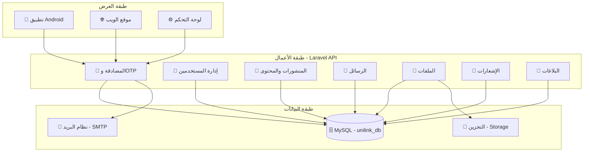

---

## 2.5 النظرة العامة للنظام (System Overview)

يمثل النظام المقترح منصة ويب تفاعلية تعمل عبر المتصفح أو تطبيق موبايل، وتتكون من عدة طبقات ووحدات رئيسة مترابطة. في طبقة الواجهة الأمامية يتعامل المستخدم مع واجهة رسومية بسيطة تسهّل عملية التسجيل وتحديث الملف الشخصي وتصفّح المجموعات والصفحات والرسائل. وتقوم طبقة منطق الأعمال (Business Logic) بتطبيق قواعد النظام، مثل التحقق من الصلاحيات قبل السماح بنشر إعلان أو إضافة عضو إلى مجموعة معيّنة، وتنظيم عمليات إنشاء المحتوى وتعديله وحذفه.

تدعم المنصة ثلاث فئات أساسية من المستخدمين: **المديرون** (إدارة النظام والجامعة)، **أعضاء هيئة التدريس والموظفون**، و**الطلبة**. لكل فئة مجموعة من الصلاحيات؛ فالمدير يمكنه إدارة حسابات المستخدمين وتحديد سياسات الخصوصية ومراجعة البلاغات، بينما يمكن لعضو هيئة التدريس إدارة مجموعات مقرراته ونشر المواد التعليمية، ويستطيع الطالب الانضمام إلى المجموعات المسموح بها والتفاعل مع المحتوى وفقًا للضوابط.

تُخَّزن جميع البيانات (مستخدمين، مجموعات، منشورات، تعليقات، رسائل، سجلات دخول ونشاط) في قاعدة بيانات مركزية تتيح للجامعة أرشفة وحفظًا منظمًا للمعلومات مع إمكانية استخراج تقارير دورية عن حجم التفاعل وأنواع الأنشطة داخل المنصة.

---

## 2.6 آلية عمل النظام (System Working Procedure)

تبدأ آلية عمل النظام بقيام مدير المنصة بتهيئة قاعدة البيانات وإضافة الفئات الرئيسة للمستخدمين واستيراد بياناتهم الرسمية من نظام القبول والتسجيل أو الموارد البشرية، ثم إنشاء الهياكل الأساسية مثل الكليات والأقسام والمقررات والوحدات الإدارية. بعد ذلك يتم إرسال بيانات الدخول إلى المستخدمين ليتمكنوا من تفعيل حساباتهم عبر البريد الجامعي أو رسالة تفعيل، ثم الدخول إلى المنصة باستخدام اسم المستخدم وكلمة المرور، مع إمكانية فرض طبقة أمان إضافية مثل التحقق الثنائي عند الحاجة.

عند دخول المستخدم إلى حسابه تظهر له واجهة رئيسية تتضمن ملخصًا للإعلانات والرسائل والمجموعات المرتبطة به. يمكن للطالب مثلًا الانضمام إلى مجموعات مقرراته أو الأنشطة الطلابية، وتصفّح الإعلانات الرسمية، والتفاعل مع المنشورات بالرد أو التعليق وفق الصلاحيات الممنوحة له، كما يمكنه إرسال رسائل خاصة أو استفسارات لأعضاء هيئة التدريس أو الإدارة. أما عضو هيئة التدريس فيستطيع إنشاء مجموعات للمقررات، ونشر مواد ومحاضرات وإعلانات الامتحانات، وإدارة التعليقات والمناقشات. ويقوم مدير النظام بمراقبة الأنشطة من خلال لوحة تحكم تعرض سجلات الدخول، والإعلانات الصادرة، والبلاغات عن أي محتوى مخالف، مع توفير إمكانيات لتعطيل الحسابات أو إخفاء المحتوى أو استخراج تقارير إحصائية عن استخدام المنصة.

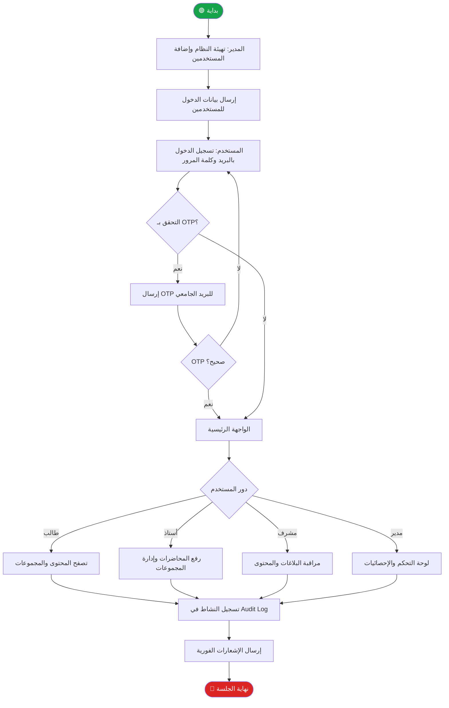

---

## 2.7 دراسة الجدوى

### الجدوى التقنية (Technical Feasibility)

يُعد تنفيذ مشروع منصة تواصل اجتماعي آمنة للجامعة من الناحية التقنية ممكنًا، نظرًا لتوفر البنية التحتية والأدوات البرمجية المطلوبة في بيئة الكلية. يعتمد النظام المقترح على تقنيات الويب الشائعة مثل HTML / CSS / JavaScript في واجهة المستخدم، مع استخدام إطار عمل مناسب لتطوير الواجهة والخلفية (مثل PHP Framework أو .NET أو أي تقنية تعتمدها الكلية)، إضافة إلى قاعدة بيانات علائقية مثل MySQL لحفظ بيانات المستخدمين والمجموعات والمنشورات وسجلات الدخول.

تتوفر في مختبرات الكلية أجهزة حاسب ذات مواصفات كافية لتطوير واختبار النظام، كما يمكن نشر النسخة التجريبية على خادم محلي (Local Server) داخل الجامعة أو على خادم سحابي منخفض التكلفة أثناء مرحلة التطوير. جميع هذه التقنيات متاحة ومألوفة لأعضاء فريق المشروع، كما أنها مدعومة بوثائق وأدوات مفتوحة المصدر، مما يقلل من المخاطر التقنية المرتبطة بتعلم تقنيات جديدة غير معروفة.

كذلك يتيح التصميم المقترح إمكانية التوسع مستقبلًا، حيث يمكن إضافة تطبيق موبايل مرتبط بواجهة برمجية (API)، أو دمج النظام مع أنظمة الجامعة الأخرى مثل نظام القبول والتسجيل أو البريد الجامعي. وبناءً على ما سبق، يمكن القول إن الجدوى التقنية للمشروع عالية، ولا توجد عوائق جوهرية تمنع تنفيذه باستخدام الإمكانيات المتاحة حاليًا.

### الجدوى التشغيلية (Operational Feasibility)

من الناحية التشغيلية، يستجيب النظام المقترح لاحتياجات الأطراف المختلفة في الجامعة؛ إذ يوفر قناة رسمية ومنظّمة للتواصل بين الطالب وأعضاء هيئة التدريس والإداريين، بدلاً من الاعتماد على مجموعات متفرقة في منصات عامة. يتوافق النظام مع إجراءات العمل الحالية، حيث يمكن استخدامه لنشر الإعلانات، وتبادل المواد التعليمية، وتنظيم الأنشطة الطلابية، مع الحفاظ على الخصوصية وربط كل عملية بحساب رسمي موثّق.

| العنصر التشغيلي | الوصف في منصة التواصل الاجتماعي الموثوقة | أثره على التشغيل |
|---|---|---|
| فئة المستخدمين المستهدفين | طلاب، موظفون، وأعضاء مجتمع الجامعة/المؤسسة ممن لديهم حسابات رسمية | سهولة تبني النظام لأن الفئة لديها خبرة مسبقة بمنصات التواصل |
| سهولة الاستخدام | واجهات عربية بسيطة، تصميم مشابه لتطبيقات التواصل المعروفة، شريط تنقل واضح | تقليل وقت التدريب، وزيادة تقبّل المستخدم للنظام |
| التحقق من الهوية | تسجيل باستخدام رقم جامعي/وظيفي + توثيق عبر البريد أو SMS | رفع مستوى الثقة في الحسابات والمحتوى المتبادل |
| إدارة المحتوى والشكاوى | لوحة تحكم للمشرفين لإدارة المستخدمين، البلاغات، المحتوى المخالف | ضمان استمرارية تشغيل النظام وتقليل إساءة الاستخدام |
| توافق النظام مع البنية الحالية | إمكانية تشغيل المنصة على خادم الجامعة وربطها ببريد الجامعة أو نظام المعلومات الحالي | الاستفادة من البنية التحتية المتوفرة، وعدم الحاجة لشراء أنظمة إضافية كبيرة |
| متطلبات التدريب | جلسة تعريفية بسيطة + دليل مستخدم إلكتروني داخل النظام | تقليل الجهد الإداري في دعم المستخدمين |

### الجدوى الاقتصادية (Economic Feasibility)

بما أن المشروع يُنفَّذ في إطار مشروع تخرج جامعي، فإن التكاليف الاقتصادية المباشرة محدودة، حيث يعتمد النظام بشكل أساسي على:
- استخدام أجهزة الحاسب المتوفرة في مختبرات الكلية.
- الاعتماد على أنظمة تشغيل وقواعد بيانات وأدوات تطوير متاحة أو مفتوحة المصدر.
- إمكانية استخدام خادم جامعي أو استضافة منخفضة التكلفة لرفع النسخة التجريبية من النظام.

| النشاط | التفاصيل | حالة التوفير / التكلفة التقريبية |
|---|---|---|
| أجهزة التطوير | استخدام أجهزة معمل الكلية أو أجهزة شخصية لأعضاء الفريق | متوفرة مسبقًا – لا توجد تكلفة شراء إضافية |
| البرمجيات المستخدمة | XAMPP، MySQL/MariaDB، VS Code، Laravel، متصفحات الويب | أغلبها مجاني أو مفتوح المصدر / مرخّص للجامعة |
| استضافة المنصة (بيئة تجريبية) | تشغيل المنصة على خادم محلي داخل الكلية أو استضافة مشتركة منخفضة التكلفة | يمكن توفيرها من القسم أو بتكلفة رمزية |
| الاتصال بالإنترنت | استخدام شبكة إنترنت الكلية أثناء التطوير والتجربة | متوفّر ضمن بنية الجامعة – بدون تكلفة مباشرة على المشروع |

---

## 2.8 إدارة المخاطر (Risk Management)

تُعد إدارة المخاطر جزءًا أساسيًا في نجاح المشاريع التقنية، حيث تساعد في توقع المشكلات المحتملة وتقليل تأثيرها على المشروع.

### أولًا: تحديد المخاطر (Risk Identification)

**1. مخاطر تقنية**
- انقطاع خادم الاستضافة أو عدم قدرته على تحمل الضغط.
- مشكلات في قاعدة البيانات مثل الضياع أو التلف.
- ضعف أداء النظام عند ازدياد عدد المستخدمين.
- أعطال مفاجئة في الوظائف الأساسية مثل تسجيل الدخول أو الإشعارات.

**2. مخاطر أمنية**
- محاولات اختراق النظام أو الوصول غير المصرح به.
- التسريب غير المقصود للبيانات بسبب ضعف في الحماية.
- إنشاء حسابات مزيفة إذا لم يتم ضبط نظام التحقق بشكل جيد.

**3. مخاطر تتعلق بالمستخدمين**
- قلة التفاعل أو عدم استخدام النظام بالشكل المتوقع.
- مقاومة بعض المستخدمين للتغيير من المنصات العامة إلى منصة رسمية جديدة.
- إساءة استخدام المنصة لنشر محتوى غير مناسب.

**4. مخاطر تشغيلية**
- نقص الخبرة التشغيلية لدى فريق الإدارة داخل المؤسسة.
- عدم وجود متابعة مستمرة للصيانة والدعم الفني.
- تأخر في إدارة المحتوى أو الموافقات.

**5. مخاطر اقتصادية**
- تكلفة أعلى من المتوقع إذا تم الاعتماد على خوادم خارجية.
- صعوبة تخصيص ميزانية مستقبلية للصيانة.

**6. مخاطر تتعلق بالتطوير**
- تأخر في تسليم النظام بسبب تعقيد المتطلبات.
- نقص مهارات بعض أعضاء الفريق.
- أخطاء في التصميم قد تظهر بعد التنفيذ.

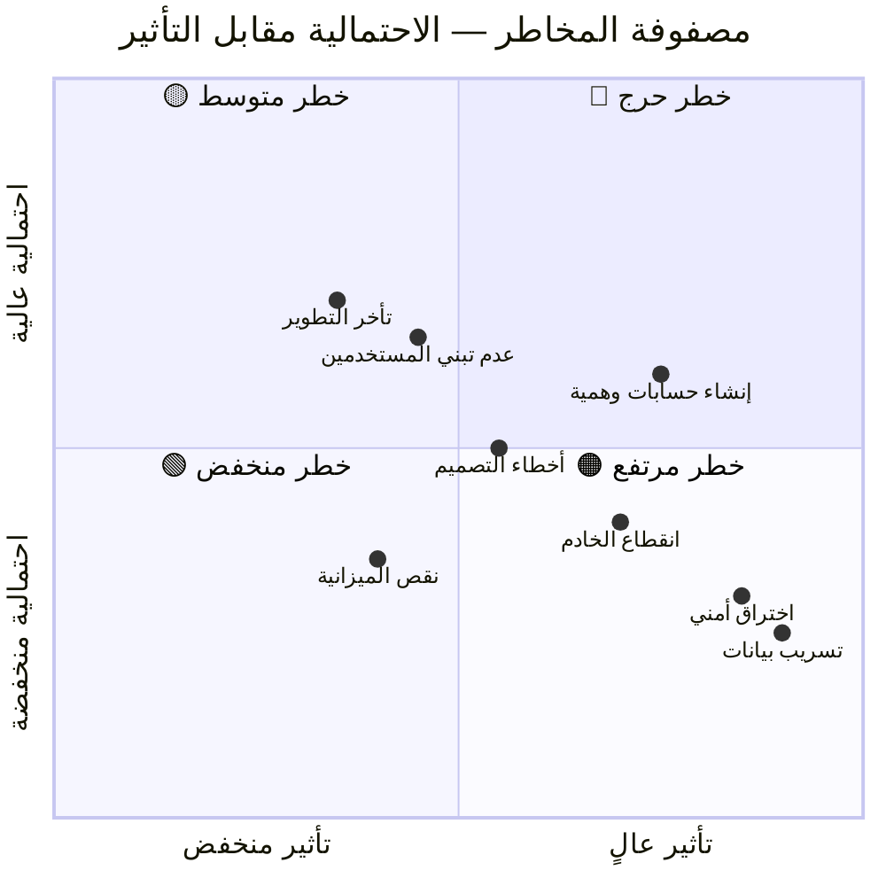

### ثانيًا: التحكم في المخاطر (Risk Control)

**1. استراتيجيات التحكم في المخاطر التقنية**
- استخدام خادم موثوق عالي الأداء أو خادم سحابي مستقر.
- أخذ نسخ احتياطية دورية لقاعدة البيانات بشكل تلقائي.
- إجراء اختبارات أداء (Stress Testing) للتأكد من قدرة النظام على تحمل الضغط.
- تصميم النظام وفق معمارية قابلة للتوسع (Scalable Architecture).

**2. استراتيجيات التحكم في المخاطر الأمنية**
- تفعيل نظام تحقق قوي يعتمد على الرقم الجامعي أو الوظيفي.
- تطبيق تشفير البيانات (Encryption) داخل قاعدة البيانات وبين الخادم والمستخدم.
- إجراء اختبارات اختراق (Penetration Testing) دورية.
- مراقبة الأنشطة داخل النظام Log Monitoring للكشف عن أي سلوك غير طبيعي.

**3. استراتيجيات التحكم في مخاطر المستخدمين**
- تنظيم ورش توعوية للمستخدمين حول فوائد النظام الجديد.
- تصميم واجهة سهلة الاستخدام تساعد على زيادة التفاعل.
- وضع سياسة استخدام واضحة تمنع إساءة الاستخدام.
- توفير دعم فني سريع للمستخدمين.

**4. استراتيجيات التحكم في المخاطر التشغيلية**
- تدريب فريق الإدارة على كيفية إدارة الصلاحيات والمحتوى.
- تخصيص فريق دعم فني يتابع النظام بشكل مستمر.
- وضع خطة صيانة شهرية أو أسبوعية حسب حاجة النظام.

**5. استراتيجيات التحكم في المخاطر الاقتصادية**
- الاعتماد على خادم الجامعة لتقليل التكلفة.
- اختيار تقنيات مفتوحة المصدر (Open Source).
- التخطيط المالي لتغطية تكاليف التحديث والصيانة السنوية.

**6. استراتيجيات التحكم في مخاطر التطوير**
- إعداد خطة عمل واضحة بمراحل وتواريخ محددة.
- تقسيم المهام داخل الفريق حسب المهارات.
- مراجعة الكود وتنفيذ اختبارات مستمرة لتقليل الأخطاء البرمجية.
- إعداد وثائق تقنية تساعد في اكتشاف الأخطاء وتصحيحها لاحقًا.

---

# الفصل الثالث
# مرحلة التحليل

## 3.1 طرق جمع المتطلبات (Requirements Collecting Methods)

تم الاعتماد على مجموعة من الأساليب المنهجية لجمع وتحليل متطلبات مشروع UniLink لضمان بناء منصة تواصل أكاديمي آمنة تلبي احتياجات الطالب والأساتذة والإدارة الجامعية. وقد شملت هذه الطرق إجراء مقابلات مختصرة مع عينات من الطالب بمستويات دراسية مختلفة واثنين من أعضاء هيئة التدريس وموظف من إدارة شؤون الطالب، بهدف فهم التحديات الحالية في التواصل الأكاديمي كضياع الإعلانات وعدم تنظيم المقررات وتشتت الملفات بين منصات متعددة.

وأثبتت هذه الطريقة فعاليتها في تقديم صورة واضحة عن الاحتياجات الأساسية للمستخدمين، حيث استُخلصت نقاط مهمة مثل صعوبة الحصول على الملفات والمحاضرات بشكل منظم، وضياع الإعلانات المهمة بسبب كثرة المجموعات، والحاجة لوسيلة تواصل رسمية وآمنة، وضرورة وجود نظام إشعارات يضمن وصول المعلومات للجميع.

كما تم إعداد استبيان إلكتروني بسيط وتوزيعه على مجموعة من طلاب الكلية لمعرفة مستوى رضاهم عن طرق التواصل الحالية وأكثر الميزات المطلوبة في منصة أكاديمية وأهم المشاكل التي يواجهونها ومدى تقبلهم لفكرة استخدام تطبيق رسمي موحد. وأظهرت النتائج أن %80 يرون أن الملفات تضيع أو يصعب الوصول إليها، و%74 يفضلون وجود منصة جامعية واحدة بدل الاعتماد على الواتساب، و%67 يرون أن الخصوصية غير محمية في المنصات العامة.

وتم أيضًا تحليل البيئة الحالية داخل الجامعة التي تعتمد غالبًا على مجموعات الواتساب والتيليجرام وبوابة الطالب محدودة الاستخدام والإعلانات الورقية أو المنتشرة في صفحات متعددة، حيث أظهر التحليل مشكلات عدم وجود منصة رسمية واحدة وتشتت المحتوى بين منصات كثيرة وافتقار الأمن والخصوصية وغياب أرشفة منظمة للمحاضرات والمواد وصعوبة متابعة الإعلانات والمهام.

| الميزة | Moodle | Google Classroom |
|---|---|---|
| التواصل الاجتماعي | محدود | محدود |
| الأمان | جيد | متوسط |
| التكامل الجامعي | ضعيف | متوسط |

---

## 3.2 متطلبات النظام (System Requirements)

### 3.2.1 المتطلبات الوظيفية (Functional Requirements)

#### أولًا: المتطلبات الوظيفية العامة (General Functional Requirements)

**1. نظام إدارة المستخدمين والمصادقة**

**1.1 تسجيل الدخول وإنشاء الحساب**
يجب أن يسمح النظام للمستخدمين بالتسجيل وإنشاء حساباتهم باستخدام معلوماتهم الشخصية والبيانات الرسمية. يجب أن يتضمن النظام آلية تسجيل دخول آمنة تتيح للمستخدمين الوصول إلى النظام من خلال التحقق من هويتهم.

**1.2 إدارة الملف الشخصي**
يجب أن يوفر النظام للمستخدمين القدرة على إدارة ملفاتهم الشخصية وتحديث معلوماتهم. يتضمن ذلك تعديل البيانات الأساسية، رفع الصورة الشخصية، وتحديث كلمة المرور.

**2. نظام التواصل والمجتمع الجامعي**

**2.1 نظام المجتمع الجامعي**
يجب أن يوفر النظام منصة تفاعلية تمكن المستخدمين من المشاركة في المجتمع الجامعي من خلال نشر المحتوى والتفاعل معه. يتضمن ذلك نشر المنشورات، الاستفسارات، الأسئلة، والتعليق عليها.

**2.2 نظام المراسلة الفورية**
يجب أن يوفر النظام نظام مراسلة فوري يسمح للمستخدمين بالتواصل المباشر. يتضمن ذلك محادثات خاصة بين الطالب ومجموعات دراسية.

**3. النظام الأكاديمي**

**3.1 نظام المواد الدراسية**
يجب أن يوفر النظام بيئة متكاملة لإدارة المواد الدراسية والمحتوى الأكاديمي. يتضمن ذلك عرض الخطط الدراسية، رفع المحاضرات، والمشاركة في المواد التعليمية.

**3.2 نظام البحث الذكي**
يجب أن يتضمن النظام محرك بحث ذكي يمكن المستخدمين من العثور على المحتوى المطلوب بسرعة وسهولة. يتضمن البحث عن المواد، الأعضاء، المنشورات، والمجموعات.

**4. نظام الإشعارات والإدارة**

**4.1 نظام الإشعارات الفورية**
يجب أن يتضمن نظام إشعارات فوري يبلغ المستخدمين عن الأنشطة المهمة. يتضمن ذلك إشعارات بالرسائل الجديدة، الردود على المنشورات، والتحديثات المهمة.

**4.2 نظام إدارة الصلاحيات**
يجب أن يدعم النظام نظام صلاحيات متعدد المستويات يحدد صلاحيات كل فئة من المستخدمين. يتضمن ذلك أدوار الطالب، الدكتور، المشرف، ومدير النظام.

**4.3 لوحة تحكم الإدارة**
يجب أن يوفر النظام لوحة تحكم شاملة تمكن الإدارة من إدارة النظام بكفاءة. تتضمن إدارة المستخدمين، البلاغات، الإحصائيات، والمحتوى.

**5. نظام التقويم الأكاديمي**
يجب أن يوفر النظام تقويمًا أكاديميًا شاملًا يعرض جميع الأحداث والفعاليات الأكاديمية. يتضمن ذلك مواعيد المحاضرات، الامتحانات، العطل، والفعاليات الطلابية.

**6. نظام الدعم الفني والشكاوى**
يجب أن يوفر النظام قنوات لدعم المستخدمين واستقبال الشكاوى. يتضمن ذلك نظام تذاكر الدعم والتواصل مع الإدارة.

**7. نظام الإعلانات الرسمية**
يجب أن يوفر النظام نظامًا للإعلانات الرسمية من الإدارة. يتضمن ذلك نشر الإعلانات المهمة والتحديثات الرسمية.

> *انظر مخطط حالات الاستخدام الكامل في قسم 7.5-أ.*

#### ثانيًا: المتطلبات الوظيفية الخاصة (Specific Functional Requirements)

**1. متطلبات المدير**

**1.1 إدارة المستخدمين والحسابات**
يجب أن يتمكن مدير النظام من إدارة حسابات المستخدمين بشكل كامل، بما في ذلك إنشاء الحسابات الجديدة، تعطيل الحسابات المؤقتة أو الدائمة، وحذف الحسابات التي تنتهك سياسات النظام. يجب أن تتضمن هذه الإدارة القدرة على تعديل صلاحيات المستخدمين ومراجعة أنشطتهم.

**1.2 إدارة الشكاوى والبلاغات**
يجب أن يتمكن مدير النظام من استقبال ومراجعة وإدارة جميع الشكاوى والبلاغات الواردة من المستخدمين. يتضمن ذلك التحقيق في البلاغات، اتخاذ الإجراءات المناسبة، ومتابعة حالات البلاغات حتى حلها.

**1.3 التحكم في صلاحيات المشرفين**
يجب أن يتمكن مدير النظام من تحديد وإدارة صلاحيات المشرفين بشكل دقيق. يتضمن ذلك منح الصلاحيات، تعديلها، وسحبها وفقًا لسياسات النظام واحتياجات الإدارة.

**1.4 عرض إحصائيات النظام**
يجب أن يوفر النظام لوحة إحصائيات شاملة تمكن المدير من مراقبة أداء النظام واستخدامه. تتضمن هذه الإحصائيات أعداد المستخدمين، المنشورات، المجموعات، والتفاعلات المختلفة.

**1.5 إدارة المواد الدراسية والخطط**
يجب أن يتمكن المدير من إدارة جميع المواد الدراسية والخطط الأكاديمية. يتضمن ذلك إنشاء المواد، تعديلها، حذفها، وإدارة الخطط الدراسية للفصول المختلفة.

**1.6 تصدير التقارير**
يجب أن يتمكن المدير من إنشاء وتصدير التقارير بصيغ مختلفة لتلبية احتياجات الإدارة والتوثيق. يتضمن ذلك تقارير الاستخدام، الأداء، والمخالفات.

**2. متطلبات الطالب**

**2.1 إنشاء الحساب والتسجيل**
يجب أن يتمكن الطالب من إنشاء حسابه الشخصي باستخدام البريد الجامعي الرسمي. يجب أن تتضمن عملية التسجيل التحقق من الهوية الجامعية وتفعيل الحساب بشكل آمن.

**2.2 الانضمام التلقائي للمجموعات**
يجب أن ينضم الطالب تلقائيًا إلى مجموعات دفعه والمجموعات الدراسية للمواد المسجل فيها. يجب أن تتم هذه العملية آليًا بناءً على بياناته الأكاديمية.

**2.3 النشر والمشاركة**
يجب أن يتمكن الطالب من نشر المنشورات التعليمية، الأسئلة، والاستفسارات الأكاديمية. يجب أن تتضمن هذه الميزة إرفاق الملفات والوسائط.

**2.4 التواصل مع الزملاء والأساتذة**
يجب أن يتمكن الطالب من التواصل المباشر مع زملائه وأساتذة المواد. يجب أن يدعم النظام الرسائل الفردية والجماعية مع إمكانية مشاركة الملفات.

**2.5 تحميل الملفات والمذكرات**
يجب أن يتمكن الطالب من تحميل الملفات والمذكرات الأكاديمية المرفوعة من قبل الأساتذة أو الزملاء. يجب أن يدعم النظام تعدد الصيغ والتنظيم الجيد للملفات.

**2.6 التقييم والمشاركة**
يجب أن يتمكن الطالب من تقييم المحتوى والمشاركة في التفاعلات الأكاديمية. يتضمن ذلك التصويت، التعليق، والإعجاب بالمحتوى المفيد.

**2.7 الإبلاغ عن المحتوى المخالف**
يجب أن يتمكن الطالب من الإبلاغ عن المنشورات أو المحتوى المخالف لسياسات النظام. يجب أن تتضمن هذه الميزة تحديد نوع المخالفة وإرسال البلاغ بشكل سري.

**2.8 تخصيص الملف الشخصي**
يجب أن يتمكن الطالب من تخصيص ملفه الشخصي وإعداداته. يتضمن ذلك تحديث المعلومات الشخصية، رفع الصورة، وتعديل التفضيلات.

**3. متطلبات الدكتور**

**3.1 نشر الإعلانات الأكاديمية**
يجب أن يتمكن الدكتور من نشر الإعلانات المتعلقة بالمادة الدراسية. يجب أن تتضمن هذه الميزة تحديد الجمهور المستهدف وإرسال الإشعارات الفورية.

**3.2 رفع المحاضرات والمراجع**
يجب أن يتمكن الدكتور من رفع ملفات المحاضرات والمراجع العلمية. يجب أن يدعم النظام تعدد الصيغ وتنظيم الملفات حسب الأسبوع أو الموضوع.

**3.3 إنشاء مجموعات المادة**
يجب أن يتمكن الدكتور من إنشاء مجموعات خاصة بمادته الدراسية. يجب أن تتضمن هذه الميزة إدارة الأعضاء والإعدادات الخاصة بالمجموعة.

**3.4 الرد على استفسارات الطالب**
يجب أن يتمكن الدكتور من الرد على استفسارات الطالب وأسئلتهم. يجب أن تدعم هذه الميزة الردود العامة والخاصة مع إمكانية الإرفاق.

**3.5 إرسال الملاحظات والإعلانات العاجلة**
يجب أن يتمكن الدكتور من إرسال ملاحظات عاجلة وإعلانات مهمة. يجب أن تتضمن هذه الميزة إشعارات فورية ووسائل تواصل متنوعة.

**4. متطلبات المشرف**

**4.1 مراقبة المحتوى والبلاغات**
يجب أن يتمكن المشرف من مراقبة المحتوى المنشور والبلاغات الواردة. يجب أن تتضمن هذه الميزة أدوات للمراجعة والتدقيق واتخاذ القرارات.

**4.2 حذف المحتوى المخالف**
يجب أن يتمكن المشرف من حذف المحتوى المخالف لسياسات النظام. يجب أن تتضمن هذه الميزة حفظ نسخة من المحتوى المحذوف وتسجيل أسباب الحذف.

**4.3 تعليق الحسابات المؤقتة**
يجب أن يتمكن المشرف من تعليق الحسابات المؤقتة للمخالفين. يجب أن تتضمن هذه الميزة تحديد مدة التعليق وإرسال إشعارات بالمخالفات.

---

### 3.2.2 المتطلبات غير الوظيفية (Non-Functional Requirements)

**1. متطلبات الأداء (Performance Requirements)**

**1.1 سرعة استجابة النظام**
يجب أن يستجيب النظام لطلبات المستخدمين بسرعة عالية، بحيث لا تتجاوز زمن تحميل الصفحات الرئيسية 3 ثوانٍ في ظروف الاستخدام العادية. يجب أن تظل أوقات الاستجابة مقبولة حتى في أوقات الذروة.

**1.2 سعة النظام الاستيعابية**
يجب أن يكون النظام قادرًا على استيعاب عدد كبير من المستخدمين المتزامنين، بحيث يدعم ما لا يقل عن 10,000 مستخدم متزامن دون تأثر الأداء. يجب أن يكون التصميم قابلًا للتوسع مع نمو المستخدمين.

**1.3 أداء رفع الملفات**
يجب أن يدعم النظام رفع الملفات بكفاءة عالية، بحيث يمكن رفع ملفات تصل إلى 100 ميجابايت بسرعة معقولة. يجب أن تتوفر تقنيات لتحسين أداء الرفع والتخزين.

**2. متطلبات الأمن (Security Requirements)**

**2.1 تشفير الاتصالات**
يجب أن تكون جميع الاتصالات بين المستخدمين والنظام مشفرة باستخدام بروتوكول TLS/SSL الحديث. يجب أن يحصل النظام على شهادة أمان صالحة وتحديثها دوريًا.

**2.2 إدارة جلسات الدخول**
يجب أن يستخدم النظام آليات أمنية متقدمة لإدارة جلسات تسجيل الدخول، مثل OAuth 2 أو JSON Web Tokens (JWT). يجب أن تتضمن صلاحية محدودة وتجديد دوري.

**2.3 حماية كلمات المرور**
يجب أن يتم تخزين كلمات مرور المستخدمين باستخدام خوارزميات تشفير مثل bcrypt مع (salting).

**2.4 حماية من الهجمات الأمنية**
يجب أن يتضمن النظام آليات متعددة للحماية من الهجمات الأمنية الشائعة مثل XSS و SQL Injection و CSRF. يجب أن تكون هذه الحمايات مدمجة ومحدثة.

**2.5 النسخ الاحتياطي للبيانات**
يجب أن يتم عمل نسخ احتياطية دورية للبيانات الهامة، مع تخزينها في أماكن آمنة. يجب أن تتضمن استراتيجية شاملة للاستعادة في حالات الطوارئ.

**3. متطلبات الجودة (Quality Requirements)**

**3.1 سهولة الاستخدام**
يجب أن يكون النظام سهل الاستخدام لجميع الفئات المستهدفة، بغض النظر عن خلفياتهم التقنية. يجب أن تكون واجهات المستخدم بديهية وتحتوي على توجيهات واضحة.

**3.2 تصميم الواجهات**
يجب أن تكون واجهات النظام بسيطة وواضحة ومنظمة بشكل منطقي. يجب أن يتبع النظام مبادئ التصميم الحديثة ويوفر تجربة مستخدم متماسكة.

**3.3 دعم المنصات المختلفة**
يجب أن يعمل النظام بكفاءة على مختلف المنصات والأجهزة، بما في ذلك الهواتف الذكية والأجهزة اللوحية وأجهزة الحاسوب. يجب أن يكون التصميم متجاوبًا مع جميع الأحجام.

**3.4 استقرار النظام**
يجب أن يكون النظام مستقرًا ويعمل بشكل متواصل دون انقطاعات غير مخطط لها. يجب أن تصل نسبة توافر النظام إلى %99.5 على الأقل.

**4. متطلبات الصيانة (Maintainability Requirements)**

**4.1 توثيق الكود**
يجب أن يكون الكود المصدري للنظام موثقًا بالكامل وبشكل واضح. يجب أن يتضمن التوثيق شرحًا للهيكل، الوظائف، والمعالجات الرئيسية.

**4.2 قابلية التحديث**
يجب أن يكون تصميم النظام قابلًا للتحديث بسهولة، مع إمكانية إضافة ميزات جديدة أو تعديل الميزات الحالية دون التأثير على استقرار النظام.

**4.3 قابلية التوسع**
يجب أن يكون النظام قابلًا للتوسع في المستقبل، مع إمكانية إضافة ميزات جديدة وتوسيع نطاق الاستخدام دون الحاجة إلى إعادة بناء كاملة.

---

## 3.3 متطلبات المستخدم (User Requirements)

1. **أمان وموثوقية عالية:** يجب أن توفر المنصة بيئة آمنة ومحصورة على أفراد المجتمع الجامعي فقط، مع ضمان سرية البيانات والمناقشات الأكاديمية والإدارية، مما يمنع تسريب المعلومات الحساسة خارج نطاق الجامعة.

2. **سهولة الاستخدام والواجهة البديهية:** يجب أن تكون واجهة المستخدم واضحة وسهلة التعلم، مع محاكاة تجربة منصات التواصل الاجتماعي المألوفة لتقليل منحنى التعلم وضمان تبني سريع من قبل جميع الفئات المستخدمة.

3. **إدارة هويات موحدة وآمنة:** يجب أن يرتبط حساب كل مستخدم بهويته الرسمية داخل الجامعة (مثل الرقم الجامعي أو الوظيفي)، مع تفعيل آلية تحقق آمنة تمنع إنشاء حسابات وهمية أو انتحال الشخصية.

4. **تنظيم المجموعات والصلاحيات بشكل هرمي:** يجب أن تتيح المنصة إنشاء وإدارة مجموعات مرتبطة بالمقررات الدراسية والأقسام والإدارات، مع تحديد صلاحيات واضحة لكل فئة من المستخدمين بما يتناسب مع دورهم الأكاديمي أو الإداري.

5. **تواصل تفاعلي مركزي:** يجب أن تدعم المنصة أدوات تواصل متنوعة تشمل نشر الإعلانات الرسمية، المشاركة في المنشورات والتعليقات، تبادل الرسائل المباشرة والجماعية، ومشاركة الملفات التعليمية والإدارية.

6. **إشعارات فورية ووصول للمعلومات في الوقت المناسب:** يجب أن يضمن النظام وصول الإعلانات والمعلومات الهامة إلى المستخدمين بشكل فوري ومنظم، مما يقلل من الاعتماد على الطرق التقليدية غير الموثوقة ويحد من انتشار الأخبار غير الدقيقة.

7. **حماية الخصوصية والتحكم في المحتوى:** يجب أن يتمتع كل مستخدم بقدر كافٍ من التحكم في إعدادات الخصوصية الخاصة به، مع توفير آليات للإبلاغ عن المحتوى غير المناسب، وإمكانية مراجعة هذه البلاغات من قبل إدارة النظام.

8. **التوافق والتكامل مع الأنظمة الجامعية الحالية:** يجب أن يدعم النظام إمكانية التكامل مع الأنظمة الأخرى في الجامعة (مثل نظام التسجيل، البريد الإلكتروني الجامعي) لتعزيز الفعالية وتقليل التكرار.

9. **أداء عالٍ وتواصل مستقر:** يجب أن يضمن النظام سرعة في التحميل والاستجابة، مع قدرة على التعامل مع عدد كبير من المستخدمين في نفس الوقت دون انقطاع أو تأخير ملحوظ، خاصة في أوقات الذروة خلال الفصل الدراسي.

---

## 3.4 تحليل المدخلات (Input Analysis)

قمنا بتحليل المدخلات في مشروع منصة التواصل الاجتماعي الآمنة للجامعة، وتحليل مجموعة واسعة من العوامل المتعلقة باحتياجات المجتمع الجامعي، وإدارة التواصل الأكاديمي والإداري. تتمثل المدخلات الرئيسية في الشاشات والوحدات التالية:

1. شاشة تسجيل الدخول والمصادقة
2. شاشة الملف الشخصي والإعدادات
3. شاشة النشر والتفاعل
4. شاشة إدارة المجموعات
5. شاشة المراسلات المباشرة
6. شاشة الإدارة والتحكم

---

## 3.5 تحليل المخرجات (Output Analysis)

في تحليل المخرجات قمنا بتحليل مشروع منصة التواصل الاجتماعي الآمنة للجامعة من خلال تقييم مدى تلبية المنصة لأهدافها وغاياتها لإخراج حسب الحاجة لضمان الأداء الأمثل لما يجب أن تقدمه المنصة، ونوضح ذلك من خلال الأمثلة التالية:

1. الشاشة الرئيسية للمنصة التي تعرض الأخبار والإعلانات
2. شاشات عرض المجموعات والمحتوى التفاعلي
3. شاشة عرض الملفات والمواد التعليمية
4. شاشة عرض سجلات النشاط والتقارير
5. شاشة عرض الرسائل والمحادثات
6. شاشة عرض الإشعارات والتنبيهات

---

# التحليل والتصميم — المخططات والنماذج

يتضمّن هذا الفصل جميع المخططات والنماذج التحليلية والتصميمية المرتبطة بمنصة UniLink، وتشمل: مخططات تدفق البيانات (DFD) بمستوييها البيئي والصفري، ومخطط العلاقة بين الكيانات (ERD)، وقاموس البيانات التفصيلي للكيانات الرئيسية، إضافةً إلى مخططات UML التي تُغطي حالات الاستخدام والبنية والتسلسل والنشاط.

---

## 7.1 مخطط تدفق البيانات — المخطط البيئي (Context Diagram)

يُمثّل المخطط البيئي أعلى مستوى في تحليل تدفق البيانات، إذ يصوّر النظام ككتلة واحدة ويُظهر علاقاته مع الجهات الخارجية دون التعمق في التفاصيل الداخلية. تتفاعل مع منصة UniLink ست جهات خارجية رئيسية: الطالب الذي يُرسل بيانات دخوله ويستقبل المحتوى الأكاديمي والإشعارات، والأستاذ الذي يرفع المحاضرات والمهام ويستقبل تقارير النشاط، والإدارة الجامعية التي تُصدر الأوامر والسياسات وتستقبل التقارير والإحصائيات، ونظام البريد الإلكتروني المسؤول عن إرسال رموز التحقق OTP، فضلاً عن نظام التسجيل الذي يُغذّي المنصة ببيانات الطلاب الرسمية، والمشرف الذي يرسل قرارات الإشراف ويستقبل بلاغات المخالفات.

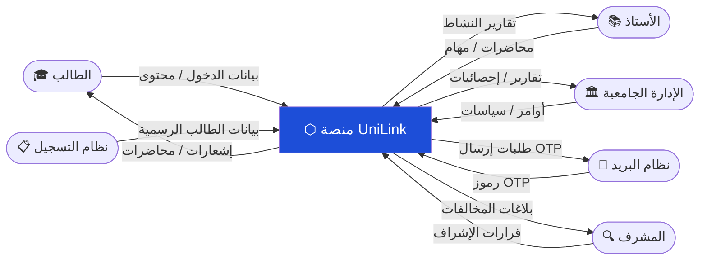

---

## 7.2 مخطط تدفق البيانات — المخطط الصفري (Level-0 DFD)

يُفصّل المخطط الصفري البنية الداخلية للنظام ويُظهر العمليات الأساسية السبع التي تشكّل المنصة، مع مسارات تدفق البيانات بينها وبين مخازن البيانات والجهات الخارجية. تشمل العمليات الرئيسية: P1 المصادقة والتحقق المسؤولة عن التحقق من هوية المستخدم وإدارة جلسات OTP، وP2 إدارة المستخدمين لإنشاء الحسابات وضبط الصلاحيات، وP3 إدارة المحتوى الأكاديمي الخاصة بالمحاضرات والملفات والمهام، وP4 التواصل والمراسلة الفورية وإدارة المجموعات، وP5 نظام الإشعارات الذي يُخطر المستخدمين بالتحديثات، وP6 لوحة التحكم الإدارية لإصدار التقارير ومراقبة النشاط، وأخيرًا P7 البحث الذكي داخل المنصة. كما تُوضّح خمسة مخازن بيانات: قاعدة المستخدمين (DS1)، ومستودع المحتوى (DS2)، وقاعدة الرسائل (DS3)، وسجلات الأنشطة Audit Log (DS4)، وقاعدة الإشعارات (DS5).

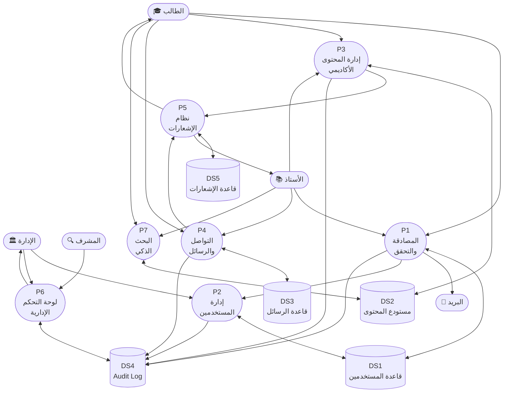

---

## 7.3 مخطط العلاقة بين الكيانات (Entity Relationship Diagram — ERD)

يُصوّر مخطط ERD بنية قاعدة البيانات الرئيسية لمنصة UniLink، ويشمل ستة كيانات أساسية مترابطة. كيان USER يمثل جميع أنواع المستخدمين (طالب، أستاذ، إدارة، مشرف) ويرتبط بعلاقات من النوع 1:N مع كيانات المنشور والرسالة والملف. كيان POST يخزّن المنشورات والإعلانات والأسئلة ويرتبط بالمجموعات والملفات. كيان MESSAGE يُدير الاتصالات الفردية والجماعية مع دعم التشفير. كيان FILE يُتتبع الملفات المرفوعة مع بيانات التشفير والتخزين. كيان GROUP يُنظّم المجموعات الدراسية والأقسام والأنشطة بأنواع خصوصية مختلفة. كيان REPORT يُسجّل بلاغات المخالفات ويُتتبع حالة معالجتها.

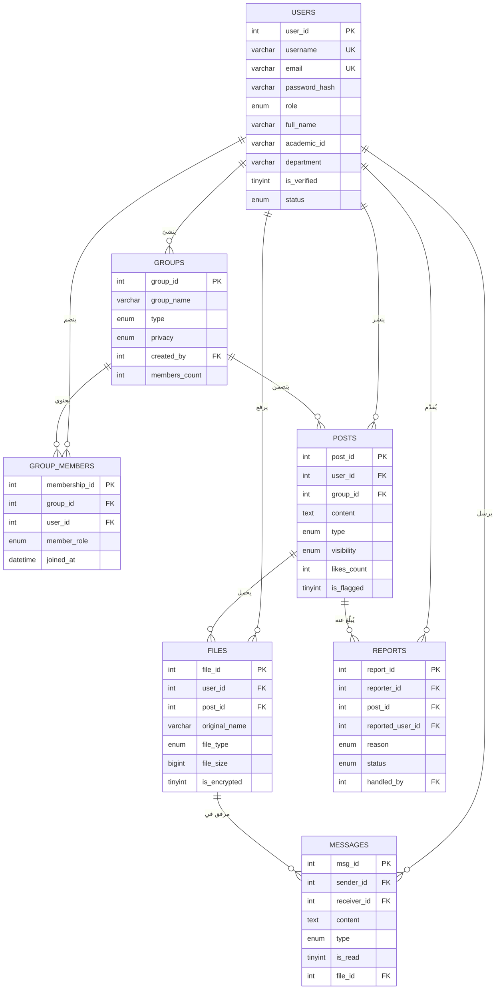

---

## 7.4 قاموس البيانات (Data Dictionary)

يوثّق قاموس البيانات تعريف كل حقل في الكيانات الرئيسية للنظام، ويشمل نوع البيانات وحجمها وقيودها ووصف وظيفتها، وذلك للكيانات الستة: USER وPOST وMESSAGE وFILE وGROUP وREPORT.

**جدول users — بيانات المستخدمين**

| الحقل | النوع | الحجم | القيود | الوصف |
|---|---|---|---|---|
| user_id | INT | - | PK, AUTO_INCREMENT | المعرّف الفريد |
| username | VARCHAR | 50 | UNIQUE, NOT NULL | اسم المستخدم |
| email | VARCHAR | 100 | UNIQUE, NOT NULL | البريد الجامعي |
| password_hash | VARCHAR | 255 | NOT NULL | كلمة المرور bcrypt |
| role | ENUM | - | NOT NULL, DEFAULT 'student' | student/professor/admin/supervisor |
| full_name | VARCHAR | 150 | NOT NULL | الاسم الكامل |
| academic_id | VARCHAR | 30 | NULL | الرقم الجامعي/الوظيفي |
| is_verified | TINYINT | 1 | DEFAULT 0 | تحقق البريد |
| status | ENUM | - | DEFAULT 'active' | active/suspended/deleted |
| otp_code | VARCHAR | 255 | NULL | رمز OTP مشفر |
| otp_expires_at | DATETIME | - | NULL | انتهاء صلاحية OTP |
| last_login | DATETIME | - | NULL | آخر دخول |

**جدول groups — المجموعات**

| الحقل | النوع | الحجم | القيود | الوصف |
|---|---|---|---|---|
| group_id | INT | - | PK, AUTO_INCREMENT | معرّف المجموعة |
| group_name | VARCHAR | 150 | NOT NULL | اسم المجموعة |
| type | ENUM | - | NOT NULL | course/department/activity/administrative |
| privacy | ENUM | - | DEFAULT 'private' | public/private/restricted |
| created_by | INT | - | FK → users | منشئ المجموعة |
| members_count | INT | - | DEFAULT 1 | عدد الأعضاء |

**جدول posts — المنشورات**

| الحقل | النوع | الحجم | القيود | الوصف |
|---|---|---|---|---|
| post_id | INT | - | PK, AUTO_INCREMENT | معرّف المنشور |
| user_id | INT | - | FK → users, NOT NULL | صاحب المنشور |
| group_id | INT | - | FK → groups, NULL | المجموعة المستهدفة |
| content | TEXT | - | NOT NULL | محتوى المنشور |
| type | ENUM | - | DEFAULT 'post' | post/announcement/question/lecture |
| visibility | ENUM | - | DEFAULT 'public' | public/group/private |
| likes_count | INT | - | DEFAULT 0 | عداد الإعجابات |
| is_flagged | TINYINT | 1 | DEFAULT 0 | موقوف لمخالفة؟ |

**جدول messages — الرسائل**

| الحقل | النوع | الحجم | القيود | الوصف |
|---|---|---|---|---|
| msg_id | INT | - | PK, AUTO_INCREMENT | معرّف الرسالة |
| sender_id | INT | - | FK → users, NOT NULL | المُرسِل |
| receiver_id | INT | - | FK → users, NOT NULL | المُستقبِل |
| content | TEXT | - | NOT NULL | محتوى الرسالة |
| type | ENUM | - | DEFAULT 'text' | text/image/file |
| is_read | TINYINT | 1 | DEFAULT 0 | هل قُرئت؟ |
| file_id | INT | - | FK → files, NULL | ملف مرفق |

**جدول files — الملفات**

| الحقل | النوع | الحجم | القيود | الوصف |
|---|---|---|---|---|
| file_id | INT | - | PK, AUTO_INCREMENT | معرّف الملف |
| user_id | INT | - | FK → users, NOT NULL | رافع الملف |
| post_id | INT | - | FK → posts, NULL | المنشور المرتبط |
| original_name | VARCHAR | 255 | NOT NULL | الاسم الأصلي |
| file_type | ENUM | - | NOT NULL | pdf/image/presentation/archive/video/other |
| file_size | BIGINT | - | NOT NULL | الحجم بالبايت (حد 100MB) |
| is_encrypted | TINYINT | 1 | DEFAULT 0 | مشفر؟ |

**جدول reports — البلاغات**

| الحقل | النوع | الحجم | القيود | الوصف |
|---|---|---|---|---|
| report_id | INT | - | PK, AUTO_INCREMENT | معرّف البلاغ |
| reporter_id | INT | - | FK → users, NOT NULL | المُبلِّغ |
| post_id | INT | - | FK → posts, NULL | المنشور المُبلَّغ عنه |
| reported_user_id | INT | - | FK → users, NULL | المستخدم المُبلَّغ عنه |
| reason | ENUM | - | NOT NULL | spam/harassment/inappropriate_content/misinformation/other |
| status | ENUM | - | DEFAULT 'pending' | pending/under_review/resolved/rejected |
| handled_by | INT | - | FK → users, NULL | المشرف المعالج |

---

## 7.5 مخططات UML

### أ) مخطط حالات الاستخدام (Use Case Diagram)

يُوضّح هذا المخطط تفاعل الأدوار الأربعة (الطالب، الأستاذ، المشرف، مدير النظام) مع الوظائف الرئيسية للمنصة.

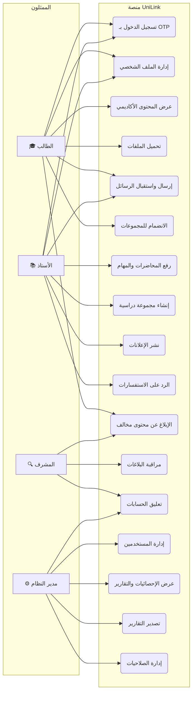

---

### ب) مخطط الفئات (Class Diagram)

يُصوّر هذا المخطط بنية الفئات الرئيسية في النظام وعلاقاتها ووراثتها.

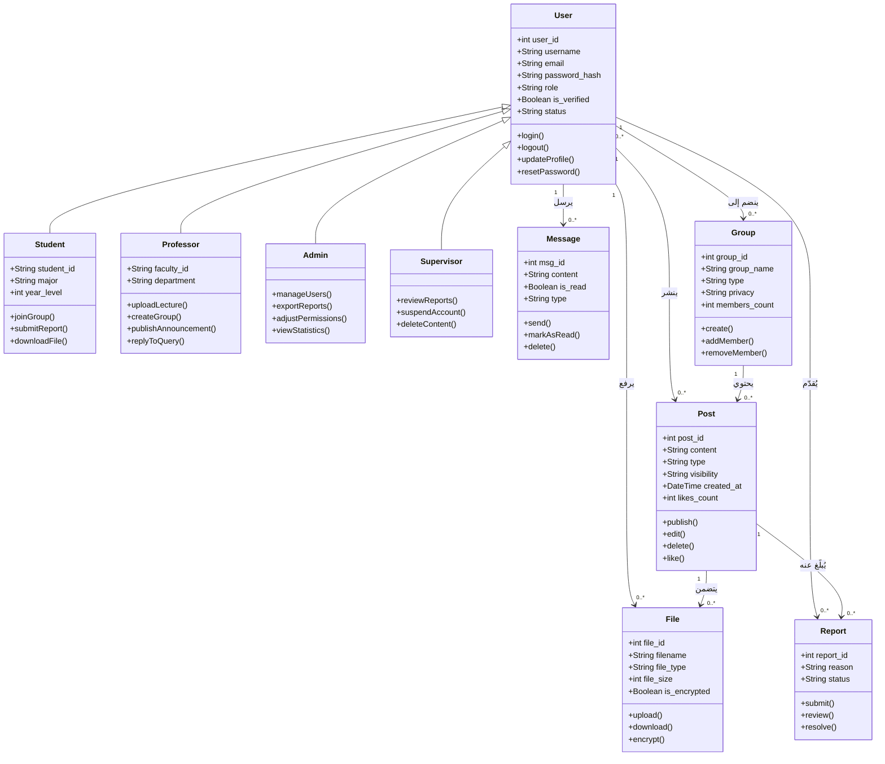

---

### ج) مخطط التسلسل — تسجيل الدخول باستخدام MFA

يُوضّح هذا المخطط التسلسل الكامل لعملية تسجيل الدخول بالتحقق الثنائي (OTP) عبر البريد الإلكتروني.

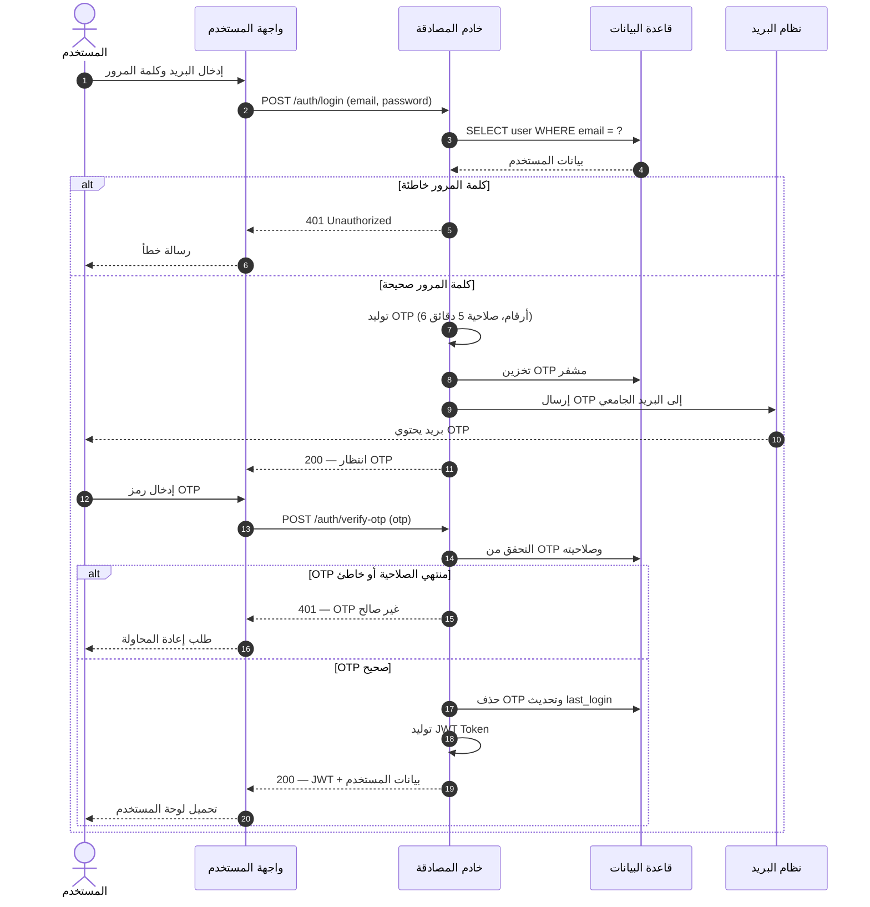

---

### د) مخطط النشاط — نشر منشور جديد

يُصوّر هذا المخطط المسار الكامل لعملية إنشاء ونشر منشور جديد، من إدخال المستخدم حتى وصول الإشعار للمستقبلين.

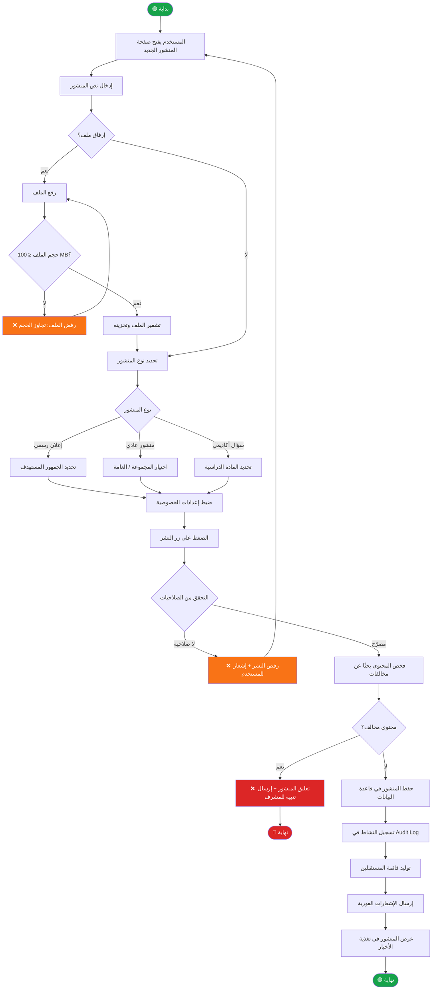

---
